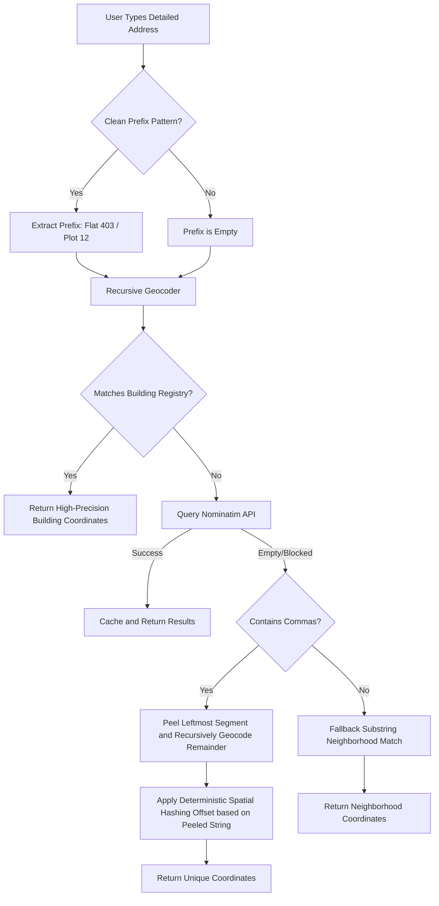

# 🤖 Agentic Engineering Deep-Dive (AGENTS.md)

This document provides a technical breakdown of the advanced geocoding, peeling algorithms, and spatial offset architectures engineered within **SafePath Hyderabad**.

---

## 🛠️ Geocoding Architecture Overview

Public geocoding databases (like OpenStreetMap Nominatim) do not index local private residences, apartment numbers, or specific buildings (e.g. `"Flat 403, Sri Sai Nilayam"`). 

To deliver a premium, seamless navigation experience where users can type any customized home address and instantly get a route, SafePath Hyderabad runs a three-tiered **recursive geocoding and peeling engine** in the backend:

---

## 🔬 Mathematical Breakdown of Spatial Offsets

When a building address is recursively resolved to its parent neighborhood, returning the identical coordinates of the neighborhood center would make different building routes appear identical. 

To solve this, SafePath Hyderabad implements a **deterministic spatial hashing offset generator**.

### The Hashing Algorithm
For any peeled building name string (e.g. `"Devi Apartments"`), we compute a stable, non-random 32-bit hash:

$$\text{Hash} = \sum_{i=1}^{n} (31 \times \text{Hash} + \text{ord}(c_i)) \pmod{2^{32}}$$

This hash is converted into a coordinate offset factors $(\Delta_{\text{lat}}, \Delta_{\text{lon}})$ mapped within a strict boundary range of $\pm 0.003$ degrees (approximately $\pm 300$ meters) to ensure the building remains correctly positioned within its neighborhood boundaries:

$$\Delta_{\text{lat}} = \left(\frac{\text{Hash} \pmod{2^{16}}}{65535}\right) \times 0.006 - 0.003$$

$$\Delta_{\text{lon}} = \left(\frac{(\text{Hash} \gg 16) \pmod{2^{16}}}{65535}\right) \times 0.006 - 0.003$$

These offsets are added to the parent neighborhood center coordinates:

$$\text{Lat}_{\text{final}} = \text{Lat}_{\text{neighborhood}} + \Delta_{\text{lat}}$$

$$\text{Lon}_{\text{final}} = \text{Lon}_{\text{neighborhood}} + \Delta_{\text{lon}}$$

This delivers **highly distinct starting map pins and safety routing alternatives** unique to the exact text typed by the user.
